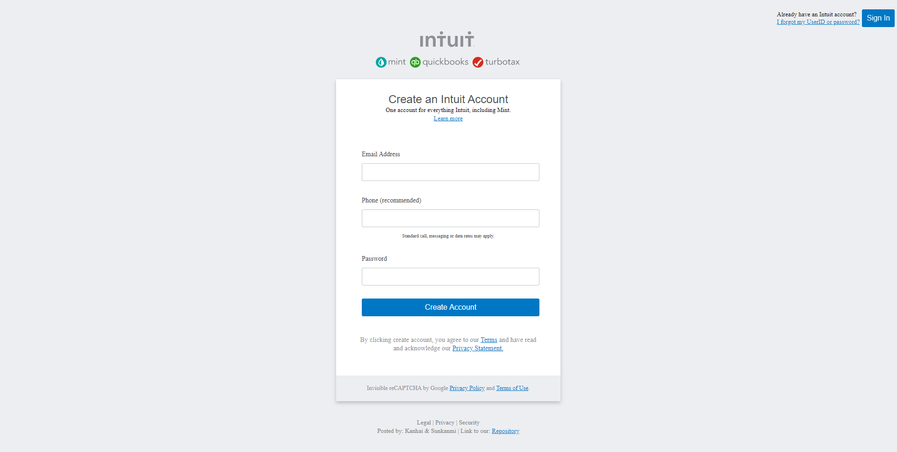

# signup-form

- Designed a signup form

## Built With

- HTML5
- CSS3

👤 **Author1**

- Github: [@jstloyal](https://github.com/jstloyal)
- Twitter: [@jstloyalty](https://twitter.com/jstloyalty)
- Linkedin: [jstloyalty](https://linkedin.com/jstloyalty)

👤 **Author2**

- Github: [@harshdeepkanhai](https://github.com/harshdeepkanhai)
- Twitter: [@harshdeepkanhai](https://twitter.com/harshdeepkanhai)
- Linkedin: [harshdeep-kanhai](https://www.linkedin.com/in/harshdeep-kanhai/)

## Show your support

Give a ⭐️ if you like this project!

## Acknowledgments

- W3Schools: [CSS Variables](https://www.w3schools.com/css/css3_variables.asp)
- Inspiration: mint.com [signup page](https://accounts.intuit.com/signup.html)

## Contributing

    > Contributions, issues and feature requests are welcome!
